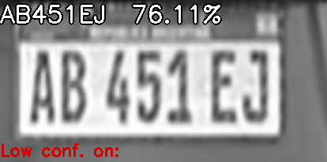
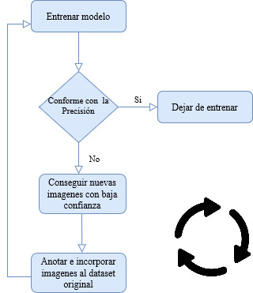

# Reconocedor de Texto(OCR) para Patentes vehiculares de Argentina

[](https://www.youtube.com/watch?v=4OG1TW4ZV8E)

**OCR** implementado con solo Redes Convolucionales (**CNN**) de Patentes Argentinas. Los modelos son entrenados con patentes de 6 digitos (viejas) y patentes del Mercosur de 7 digitos (las nuevas). Este repo esta dedicado solamente al modulo que se encarga de reconocer texto de la patente ya recortada.

Es común que se aplique una **ConvNet(CNN)** y una **Recurrent Neural Net. (LSTM/GRU)** para modelar este tipo de problema de secuencia de caracteres a partir de una imagen. En este caso se implementan solo ConvNets debido a:
* Se busca deployear en **sistemas embebidos** como RaspBerry Pi + Accelerator, por ende tiene que ser ligero. Además Accelerators como el de Google Coral, no están optimizados para Redes Recurrentes
* No tenemos el problema de una **secuencia variable de longitud**. El máximo de caracteres posibles es 7 (para Argentina) por ende las patentes de 6 digitos se le asigna una caracter extra para indicar el faltante.

To **train on your custom dataset** a detailed explanation can be found [here](https://github.com/ankandrew/cnn-ocr-lp/wiki/Train-your-custom-OCR)

## Uso

### Instalar dependencias

Contar con **python 3.x**, instalar los requerimientos:

```
pip install requirements.txt
```

## Visualizar predicciones

```
python demo_recog.py -m models/m1_93_vpa_2.0M-i2.h5 -i benchmark/imgs --time
```

*Se visualizaran las predicciones hechas a patentes que se encuentren en la carpeta **benchmark/imgs/*** y se muestra el tiempo que tarda en hacer inference

## Calcular precisión

```
python valid.py -m models/m1_93_vpa_2.0M-i2.h5
```

Ejemplo de salida:

`loss: 1.3214 - cat_acc: 0.9845 - plate_acc: 0.9388 - top_3_k: 0.9961`

*La precisión se calcula en base a las imagenes de benchmark/*

### Train

Para entrenar algun modelo desde cero, pasos estan en la [wiki](https://github.com/ankandrew/cnn-ocr-lp/wiki/Inicio)

## Models

Los modelos son las tipicas ConvNet, y estan formadas por bloques de **Convolution -> BatchNorm -> Activation -> MaxPooling** ... hasta formar un volumen de HxWx1024 *(altura x ancho x canales)* ... se le aplica **GlobalAvgPooling** para formar un volumen de 1x1x1024 que se conecta (mediante una Fully Conected Layer) con 37 x 7 unidades con activacion `softmax`. El numero 37 viene de 26 (vocabulario) + 10 digitos + simbolo de faltante `'_'`, por 7 porque por cada posición tiene una probabilidad de 37 caracteres. Los **bloques usados** para la ConvNet se encuentran en [layer_blocks.py](fast_plate_ocr/layer_blocks.py).


Un segundo modelo borra por completo las Dense layers y aplica [Softmax](https://github.com/ankandrew/cnn-ocr-lp/blob/25ad10916adb30ac33106bce19d85f92d45a7db6/models.py#L101) directamente a la salida del volumen de la ConvNet. Es recomendable probar ambas versiones, pero los experimentos muestran que sin las Dense/Fully Connected layers, tienda a overfittear menos el modelo.

## Características

* **Regularización**: Se probo [DropBlock](https://arxiv.org/abs/1810.12890), DropOut y l2 reg. a los filtros. Este ultimo junto a [CutOut](https://arxiv.org/abs/1708.04552) dieron los mejores resultados
   * **Label Smoothing**: le da un 10% notorio de aumento de `plate_acc`. Se suavizan los one-hot encoding y pasan de ser (por ejemplo) ```[0, 0, 0, 1]``` a ```[0.03, 0.03, 0.03, 0.91]```
* **Data Augmentation**: Se usa la augmentacion estandard de Keras y se aplica:
    * Cambios de brillo
    * Leve rotaciones
    * Shearing (tambien leve)
    * Zoom
    * Desplazamiento Vertical/Horizontal
* **Extra Data Augmentation**:
    * CutOut
    * Motion-Blur
* **Input**
   * Imagen **blanco & negro**
       * 70x140 *(altura x ancho)*
       * Interpolacion **bilineal**

## Validación

Para validar la calidad de los modelos se utilizara *principalmente* una metrica personalizada `plate_acc`. Esta simplemente calcula el porcentaje de patentes bien categorizadas **en su totalidad**.

Ejemplo si se tiene 2 patentes: { `AB 123 DC`, `GKO 697` } y se predice { `AB 123 CC`, `GKO 697` } la precisión es de 50%, una patente correctamente reconocida y la otra no.
Métrica definida en Keras:
```python
from keras import ops

def plate_acc(y_true, y_pred):
    et = ops.equal(ops.argmax(y_true), ops.argmax(y_pred))
    return ops.mean(
        ops.cast(
            ops.all(et, axis=-1, keepdims=False),
            dtype="float32",
        )
    )
```

Ninguna imagen (como corresponde) del benchmark fue usada para entrenar el modelo. Para evaluar mejor la precisión se necesita un validation-set **publico** con mas imagenes, ya que el que se encuentre en el repo son solo 150~ imagenes.


## Set - Validación

La fuente del set de validación proviene de [video night drive](https://www.youtube.com/watch?v=75X9vSFCh14) y [video morning drive](https://www.youtube.com/watch?v=-TPJot7-HTs). Créditos a [J Utah](https://www.youtube.com/channel/UCBcVQr-07MH-p9e2kRTdB3A).

Formato de *benchmark/anotaciones.txt* (separado por tab):
```
imgs/nombre_imagen.png  ABC 123 DE
```

*Si desean colaborar para expandir el set de validación, mejor para validar la precisión de los modelos.*

## Active Learning

Hacer las anotaciones de miles de patentes resulta un trabajo **largo** e **impractico**. Por eso se propone, **"Active Learning"** que simplemente con el modelo base entrenado (con 1800~ imagenes) se predicen patentes no vistas. Luego anotan solo las patentes de **baja confianza**. Este es un proceso **iterativo** y se repite hasta llegar a la precisión deseada (en el test de validación)



Para decidir si la prediccion tiene poca confianza, se utiliza:

* Si por lo menos un caracter esta poco seguro
```python
def on_any(probs, thresh=.3):
  return any([True if prob < thresh else False for prob in probs])
```

* Si el promedio de todos los caracteres esta por debajo de un valor
```python
def on_avg(probs, avg_thresh=.2):
  return statistics.mean(probs) < avg_thresh
```

*Métodos no optimizados, solo para ilustración*

En la siguiente tabla se va a mostrar los modelos (misma arquitectura) pero con más imagenes de entrenamiento, basado en el criterio anterior. Para eliminar la varianza en los resultados, y ver el impacto de agregar mas imagenes al dataset de entrenamiento: la arquitectura, método de optimizacion, Data Augmentation ... no cambian en lo absoluto.

#### Modelo 2 (1.5 M parametros)

| iteracion | Set-Entrenamiento | cat_acc    | plate_acc    | top_3_k    |
|-----------|-------------------|------------|--------------|------------|
| 1         | 1853              | 0.9495     | 0.8435       | 0.9757     |
| 2         | 2873              | **0.9786** | 	 **0.8912** | **0.9922** |
| 3         | -                 | -          | -            | -          |

#### Modelo 1 (2 M parametros)

| iteracion | Set-Entrenamiento | cat_acc    | plate_acc   | top_3_k     |
|-----------|-------------------|------------|-------------|-------------|
| 1         | 1853              | 0.9602     | 	0.8639     | 	0.9806     |
| 2         | 2873              | **0.9845** | 	**0.9388** | 	**0.9961** |
| 3         | -                 | -          | -           | -           |


* **top_3_k** calcula que tan seguido el caracter verdadero se encuentra en las 3 predicciones con mayor probabilidades
* **cat_acc** es simplemente la [CategoricalAccuracy](https://www.tensorflow.org/api_docs/python/tf/keras/metrics/CategoricalAccuracy) para problemas de multi-class labels. **Ejemplo** si el label correcto es `ABC123` y se predice `ABC133` no va a dar una precisión de 0% como plate_acc *(no clasificada correctamente en su totalidad)*, sino de 83.3% (5/6)

*Estas metricas estan ubicadas en el archivo custom.py*

## Data Augmentation


Configuracion de Data Aug en Keras:

```python
datagen = ImageDataGenerator(
    rescale=1/255.,
    rotation_range=10,
    width_shift_range=0.05,
    height_shift_range=0.10,
    brightness_range=(0.5, 1.5),
    shear_range=8,
    zoom_range=0.12
)
```

Ademas como metodos extras de Data Augmentation se incluyo Blur y CutOut, se puede encontrar definido en `extra_augmentation.py`.

**Aclaracion**: A proposito se busco, *manualmente*, que de vez en cuando los caracteres salgan **un poco** del frame. Esto ayuda a que generalice mejor y que no se espere una patente recortada perfectamente.

## Tiempo de inferencia

El tiempo medido no cubre el preprocessing, es cuanto tarda en hacer **solo la inferencia** el modelo (Usando `batch=1`). Los modelos que dicen **CPU** *(#3 y #4)* estan hechos para que corran mas rapido en el procesador. La diferencia principal es que se cambia la op. de [Convolucion normal](https://www.tensorflow.org/api_docs/python/tf/keras/layers/Conv2D) por una [Separable Conv](https://www.tensorflow.org/api_docs/python/tf/keras/layers/SeparableConv2D).

#### Inferencia con GPU (Nvidia GTX 1070)

| Modelo # (Parametros - GPU/CPU)  | ms | FPS | Precisión |
| ----------  | --------- | --------- | ----|
| Modelo 1 (1.5 M - GPU) | 2.12 | 471 | FP32 |
| Modelo 2 (2.0 M - GPU) | 1.71 | 584 | FP32 |
| Modelo 3 (1.4 M - CPU) | 1.54 | 650 | FP32 |
| Modelo 4 (1.1 M - CPU) | **1.36** | **735** | FP32 |
| -  | - | - | - |


#### Inferencia con CPU (Intel i7-7700)

| Modelo # (Parametros - GPU/CPU)  | ms | FPS | Precisión |
| ----------  | --------- | --------- | ----|
| Modelo 1 (1.5 M - GPU) | 11.1 | 90 | FP32 |
| Modelo 2 (2.0 M - GPU) | 12.2 | 82 | FP32 |
| Modelo 3 (1.4 M - CPU) | 6.55 | 152 | FP32 |
| Modelo 4 (1.1 M - CPU) | **5.88** | **170** | FP32 |
| -  | - | - | - |

*FP32: para las weights y activaciones se usan valores de floating point de 32 bits*

## TODO

- [x] Publicar modelos
- [x] Label Smoothing
- [x] Active Learning
- [x] Ampliar val-set
- [x] Aumentar el training-set de patentes de motos
- [x] Disminuir # de parametros
- [x] Aplicar blur a las imagenes(Data Augmentation)
- [x] Aplicar CutOut a las imagenes(Data Augmentation)
- [x] Implementar Motion Blur (Data Augmentation)
- [x] Implementar modelo sin Dense/FC
- [ ] Agregar script de time benchmark
- [ ] Quantizar el modelo a INT8 (Post-Training / Aware-Training)
- [ ] Compilarlo para [Edge TPU](https://coral.ai/docs/edgetpu/compiler/)

### Notas

* Para obtener la mejor precisión es recomendable obtener las patentes recortadas con [YOLO v4/v4 tiny](https://github.com/ankandrew/LocalizadorPatentes)
* CutOut si bien es Data Augmentation (Pone rectangulos negros random en la imagen de entrada) tiene efecto de regulación. Por ende no hace falta usar l2 reg, se puede usar directamente el `block_bn_no_l2` encontrado en `layer_blocks.py`
* Motion Blur tiene mas sentido que aplicar blur, simula el efecto de que fue captada en movimiento
